# LabelProof — Evidence, not assumptions

**SIH26034 concept · Packaged-food label review workspace · Version 3.2**

Scan a packaged product, follow its image evidence, and understand what was observed, what is unreadable, and what still needs a photograph. LabelProof turns label review into a transparent, traceable workflow.

**[Open dashboard](https://labelproof-prototype.vercel.app/dashboard)** · **[Public landing page](https://labelproof-prototype.vercel.app/)** · **[Sample report](https://labelproof-prototype.vercel.app/dashboard/scans/demo-oats)** · **[Implementation report](docs/IMPLEMENTATION_REPORT.md)**

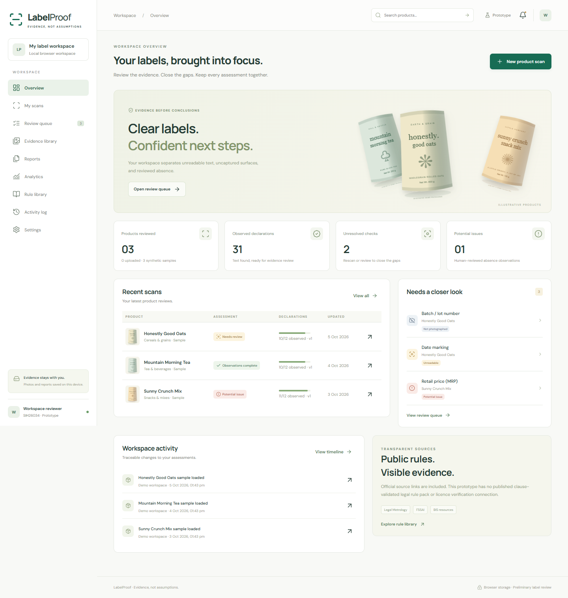

## Demo login

Open [Account & privacy](https://labelproof-prototype.vercel.app/dashboard/account), then choose **Sign in to demo**, or use:

- Email: `demo@labelproof.example`
- Password: `LabelProofDemo!2026`

These credentials are intentionally public. The real cloud account can read only the **LabelProof Demo** organization, containing three synthetic products. Team edits, cloud uploads, report changes, password/email changes, identity linking and MFA enrollment are blocked on the server. Local experiments are available on your device; use your own account for real product photos. Demo sign-out ends only the current browser session.

To restore the samples from cloud: Team & cloud → Load my organizations → Select LabelProof Demo → Download cloud workspace.

Email provider chosen: **Resend**. The owner currently has no sender domain, so public signup and password-recovery email delivery remain pending domain verification, provider credentials and Supabase dashboard settings. Email confirmation stays enabled. Legal validation and distributed remote OCR remain separate production gates.

## v3 additions

[Complete release and readiness report](docs/V3_RELEASE.md).

Added persistent capture drafts, resumable browser batches, barcode reading, quality hints, reviewer assignments/comments/preliminary approvals, comparisons, rule-review drafts, an English searchable PDF layer, retention reminders, offline app shell and six new workspace pages. Account/team/private-storage integration and server-enforced organization schema are included; the approved LabelProof cloud project is active in Mumbai, with private images, password login for confirmed accounts, team roles and version-checked workspace sync. Public signup/recovery delivery and redirects await email-provider setup and a Supabase dashboard session. Legal validation, registry integration and a remote OCR worker remain unimplemented. This release is not certified production-ready.

## Interaction fixes in v2.1

See the [button and recovery audit](docs/BUTTON_AUDIT.md) for checks and limits.

- Download complete PDFs with all findings, notes, sources, comparison values, photos and highlights. Text pages preserve browser script shaping as images; CSV/JSON are searchable.
- Rescan from the selected queue declaration; preserve conflicting evidence and comparison buttons through backup import.
- Close mobile navigation via its button, backdrop, Escape or a destination link.
- Cancel OCR and retain photos for retry. Recognition failures are caught; worker operations time out after 90 seconds.
- Reject invalid backups and reset the chooser. Cancel capture discards its draft; normal in-app navigation retains entered details.
- Guard repeated saves and provide recovery links for unavailable report versions.

## Dashboard release features

The original single-screen prototype has become a separate dashboard with nine workspace pages, real browser OCR, persistent images, assessment history, import/export and review tools. The public landing page remains separate at `/`; the workspace opens at `/dashboard`.

- Added Overview, My scans, Review queue, Evidence library, Reports, Analytics, Rule library, Activity log and Settings.
- Loaded three explicitly labelled synthetic product scenarios, with original illustrative packaging and matching label panels.
- Replaced summary-only local storage with an IndexedDB database that retains original image blobs, extraction text, evidence coordinates and reports after reload.
- Added immutable assessment versions, product snapshots, image snapshots and correction rationale.
- Added conflicting-value detection across photographs, targeted rescanning and manual applicability review.
- Added full workspace backups with embedded uploaded images, report JSON, CSV and downloadable PDF with a complete evidence appendix.
- Added backup validation, source-image validation, SHA-256 hashing, CSV formula escaping and individual/local-workspace deletion.
- Added English and English/Hindi OCR settings, workspace preferences, source-review drafts and an activity timeline.
- Added two Vercel serverless metadata endpoints, automated checks, a CI workflow template, screenshots and system documentation.

## Honest scope

**This is a working label-observation prototype, not a legal compliance certification service.**

OCR detects declaration text. It does not automatically validate every clause, category exception, effective date, physical font size, nutrition value or licence authenticity. Source references are official entry points, not a published legal rule pack. Applicability starts as unknown; reviewers can record their assessment with a rationale.

The deployment supports local IndexedDB plus an active Supabase PostgreSQL database, confirmed-account authentication, private evidence storage and server-enforced organization roles. Cloud upload/download are explicit actions on Team & cloud. Public account email delivery and recovery redirects still need configuration. Government registry verification, validated legal rules, remote OCR workers, automatic backup restoration, account deletion and external incident alerts remain release gates. See [cloud activation and verification](docs/CLOUD_ACTIVATION.md).

## Features and routes

| Feature | Route | What works |
| --- | --- | --- |
| Public landing | `/` | Feature overview, product imagery, dashboard and sample-report links |
| Dedicated dashboard | `/dashboard` | Counts derived from saved data, product previews, review priorities and activity |
| Product library | `/dashboard/scans` | Search by name/brand/category, sample/upload/review filters, report navigation |
| Guided capture | `/dashboard/new` | Drag/drop, upload, mobile camera input, seven surface labels, readability classification |
| Evidence report | `/dashboard/scans/:id` | Image highlights, observation details, sources, applicability, corrections, OCR provenance |
| Review queue | `/dashboard/review` | Separate filters for uncaptured, unreadable, review, conflict and potential-issue states |
| Evidence gallery | `/dashboard/evidence` | Saved image previews, surface filter, image inspection and OCR text |
| Report archive | `/dashboard/reports` | Reopen any assessment version, including read-only earlier versions |
| Analytics | `/dashboard/analytics` | Observation distribution, capture coverage and open checks; no invented compliance score |
| Rule library | `/dashboard/rules` | Official references, detector inventory and persistent draft review notes |
| Activity timeline | `/dashboard/activity` | Scans, corrections, exports, imports, preferences and draft changes |
| Account | `/dashboard/account` | Confirmed-account login/logout, password update, signup/recovery controls with email-setup status |
| Team & cloud | `/dashboard/team` | Organization creation/selection, server-enforced roles, private image upload and version-checked snapshot sync |
| Processing | `/dashboard/processing` | Persistent browser batches, retry and interruption recovery |
| Review workflow | `/dashboard/approvals` | Local preliminary decisions and server role-checked team review records bound to a snapshot and assessment hash |
| Comparison | `/dashboard/compare` | Side-by-side assessment findings |
| Readiness | `/dashboard/operations` | Health checks, review drafts and evaluation exports |
| Settings | `/dashboard/settings` | Workspace/reviewer names, OCR language, uncertainty threshold, backup/import and deletion |

All pages are usable on desktop and mobile. The mobile navigation opens from the menu button. File-backup imports get new identifiers. Cloud downloads retain a per-account, per-organization ID mapping, so repeated downloads update matching cloud records without duplicates. Unrelated local records remain available; export unsynced work before downloading.

## The evidence model

| Observation | Meaning | Next step |
| --- | --- | --- |
| Observed | Text was detected or manually confirmed with a source image | Review the complete declaration and applicable requirement |
| Unreadable | The text/image cannot be read reliably | Retake the relevant area |
| Not photographed | No relevant surface image is available | Add a photograph; suggested surfaces are capture hints |
| Needs review | OCR did not establish the declaration from captured evidence | Inspect the images before deciding whether to rescan |
| Conflicting | Different images produced different values | Compare all retained observations |
| Potential issue | A reviewer recorded an absence with applicability, readable-coverage confirmation and a rationale | Review the legal requirement before a final conclusion |
| Not applicable | A reviewer recorded non-applicability with a rationale | Verify the exception against the operative source |

**OCR non-detection never automatically becomes a missing declaration.** The quantity detector also avoids treating a serving size as net quantity.

Every manual change creates a new assessment. Earlier findings remain intact. A changed observed value clears its previous highlight unless a new valid region is provided; the application does not invent a box for unobserved information.

## Declaration inventory

The current observation pack has 12 detectors:

1. Net quantity.
2. Retail price / MRP.
3. Relevant manufacturer declaration.
4. FSSAI declaration text.
5. Batch / lot number.
6. Date marking.
7. Ingredients.
8. Consumer-care text.
9. Nutrition declaration.
10. Allergen declaration.
11. Origin declaration.
12. Storage instructions.

These are candidate declarations, **not a universal checklist of legally mandatory fields**. Category applicability and exceptions need review. Symbols and logos are not automatically interpreted by this text OCR implementation.

## Screenshots and images

### Evidence-linked report

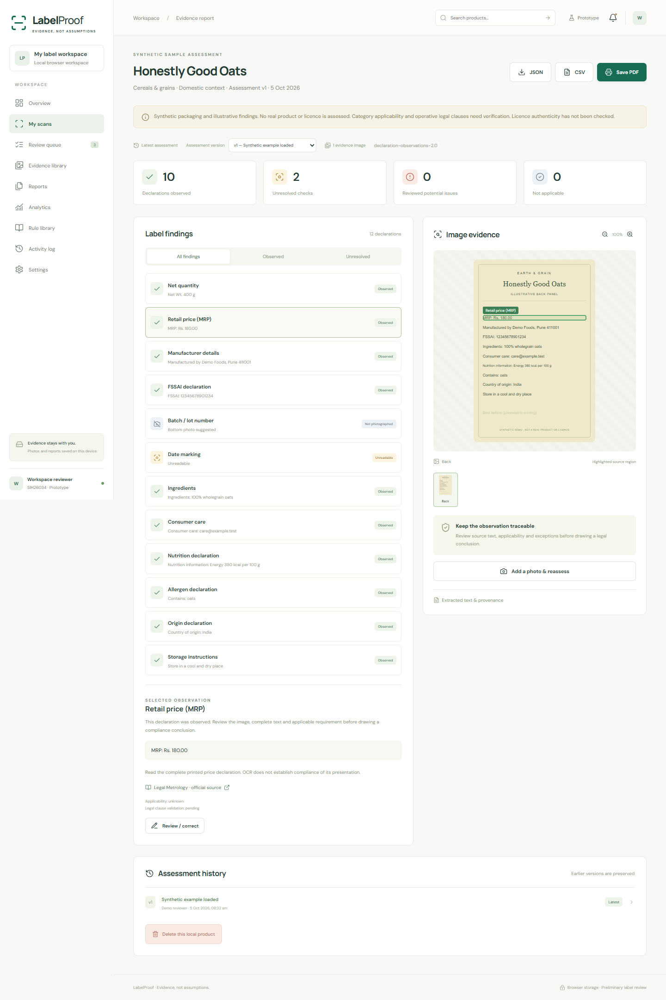

### Guided capture

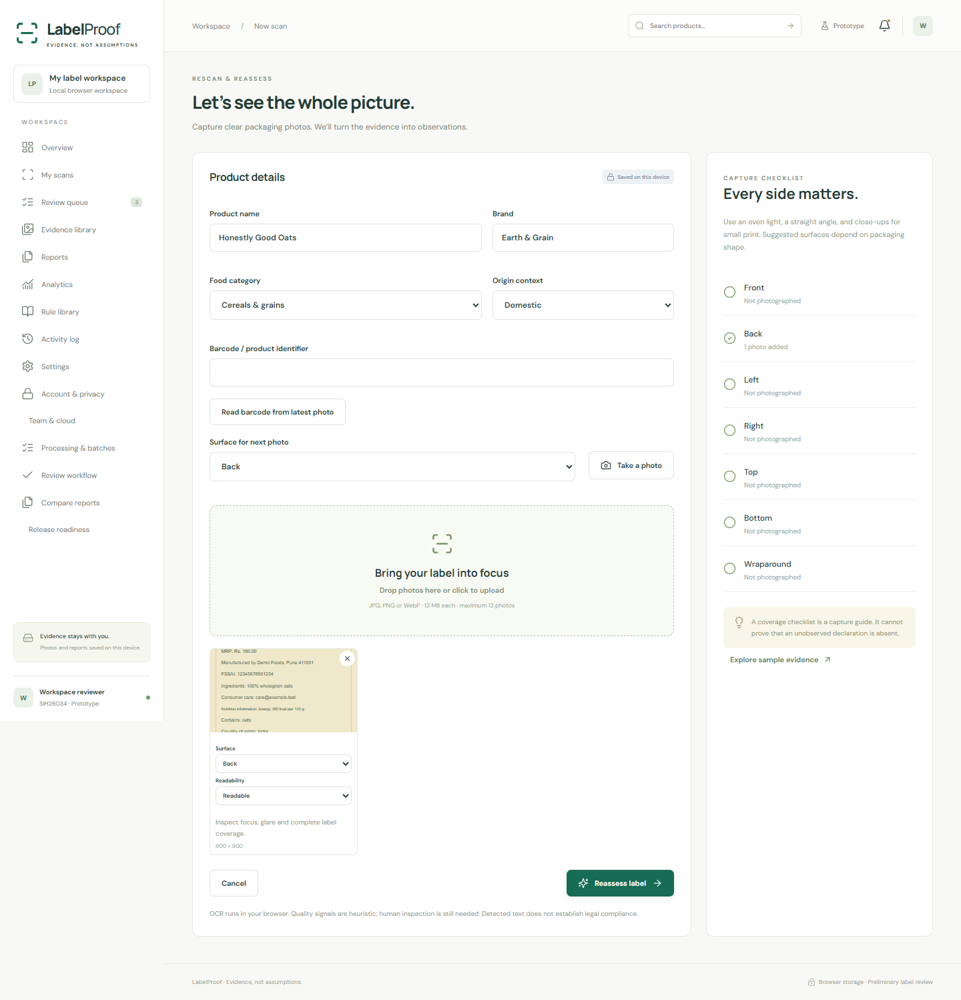

### Review queue

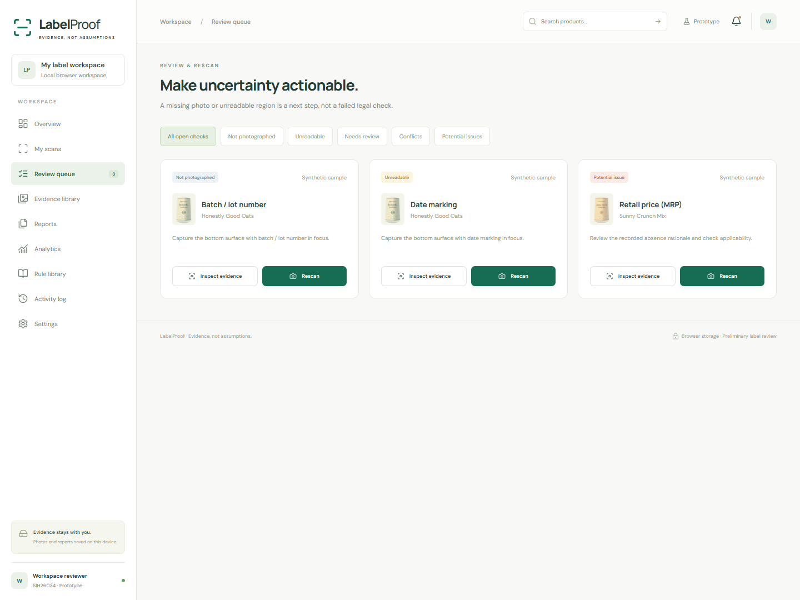

### Evidence library

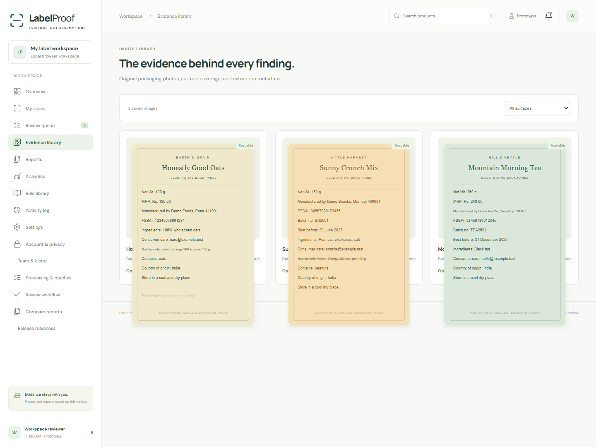

### Analytics

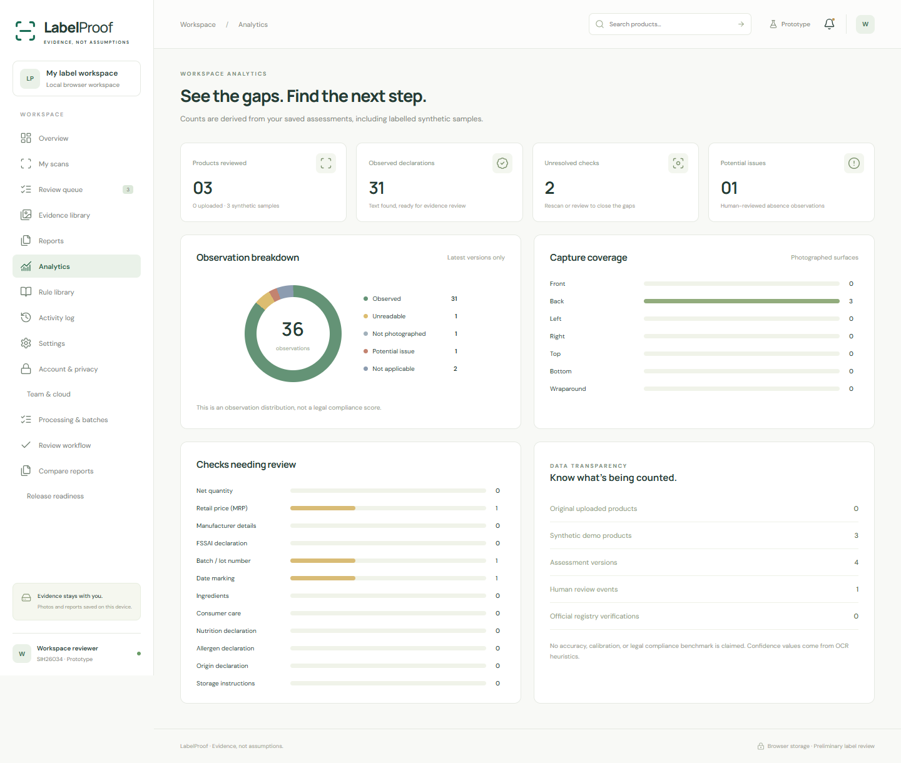

<details>
<summary>More screens</summary>

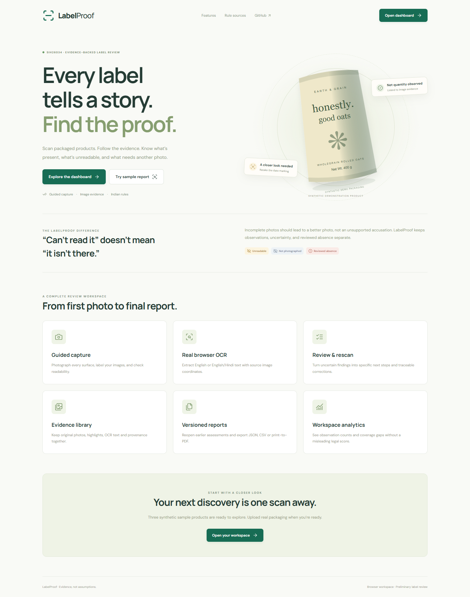

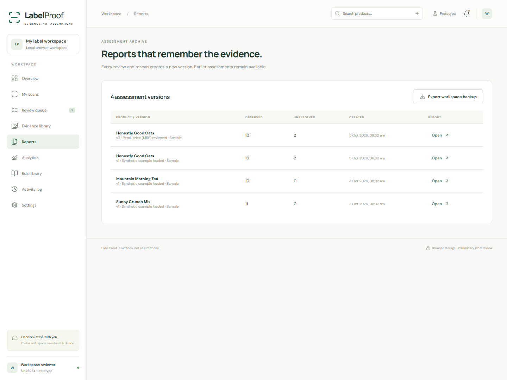

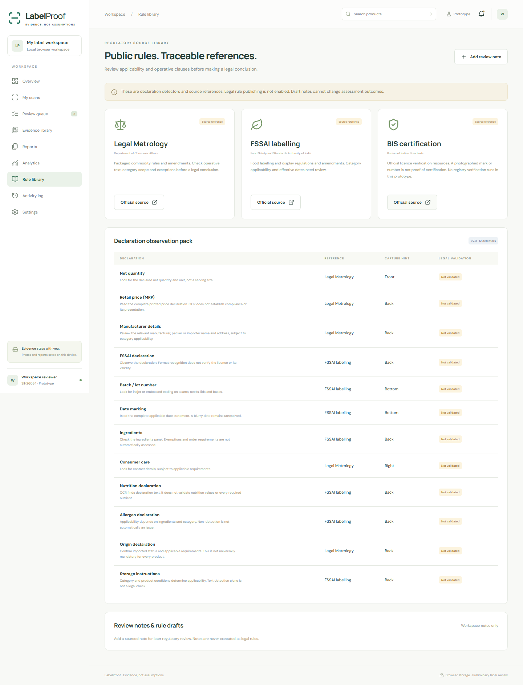

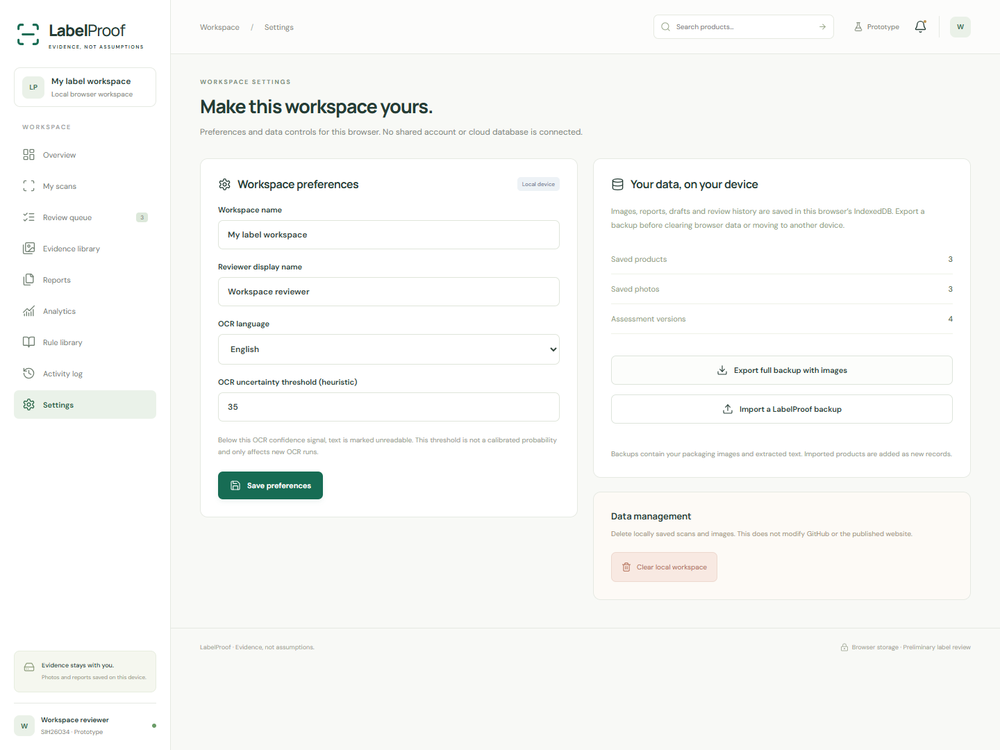

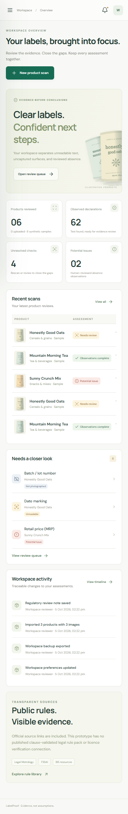

</details>

### Included product assets

| Honestly Good Oats | Mountain Morning Tea | Sunny Crunch Mix |
| --- | --- | --- |
|  | 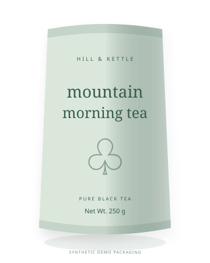 | 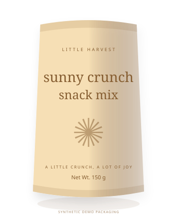 |
| Unphotographed batch area and unreadable date | Illustrative complete observation/review scenario | Illustrative reviewed price absence |

All product names, packaging, label values, contact details and licence numbers are **synthetic**. They are not collected real-brand labels and do not establish a real compliance violation. Asset generation is reproducible with `npm run assets`. Screenshots contain only synthetic demonstration data.

A generated, illustrative PDF is included at [docs/sample-report.pdf](docs/sample-report.pdf).

## Quick start

Requirements: Node.js 22+ recommended; development and checks were performed with Node.js 24 and Chrome.

```bash
git clone https://github.com/codexanjan/labelpoof.git
cd labelpoof
npm ci
npm run dev
```

Open the local URL shown by Vite, normally `http://localhost:5173`. Three samples load once when a browser workspace is first initialized.

```bash
npm test
npm run build
npm run preview
```

No OCR key or application secret is needed. English/Hindi language data and the OCR worker download on first use, so that first OCR run requires network access. Google Fonts is an external presentation dependency; fallback fonts are available. Images are not sent to an OCR API.

To inspect Vercel functions locally, use `vercel dev`; ordinary Vite development serves the frontend only.

## How to use

1. Open the dashboard and inspect the three sample scenarios.
2. Choose **New product scan**, enter product details and add packaging photographs.
3. Select the surface for each image. Photograph curved/wraparound labels in several overlapping views if needed.
4. Run **Review label**. OCR extracts text and image coordinates.
5. Select a finding to inspect its evidence and official source reference.
6. Use **Review / correct** to record exact text, applicability and a rationale. Optional image-box coordinates must stay inside the image.
7. Use **Add a photo & reassess** for uncertain findings. Conflicting readings stay visible.
8. Reopen earlier versions from the report selector or report archive.
9. Export report JSON, CSV or choose **Save PDF**, download the complete report with its image appendix.
10. Export a full workspace backup from Settings before clearing site data or moving devices.

## System architecture

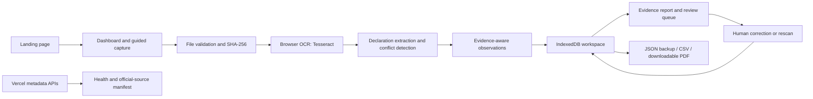

| Layer | Implementation |
| --- | --- |
| Frontend | JavaScript ES modules, accessible HTML, responsive CSS, Lucide icons |
| Build | Vite 6.4.3 with a lockfile; OCR is loaded on demand |
| OCR | Tesseract.js 6.0.1, English or English + Hindi |
| Observation engine | Deterministic declaration detectors, uncertainty states and cross-image conflict retention |
| Database | IndexedDB object stores; original images remain binary blobs |
| Backend | Vercel serverless health and source-manifest endpoints |
| Reports | Versioned assessment snapshots, JSON, CSV, downloadable PDF |
| Hosting | Vercel production deployment with dashboard-route rewrites |

### Current database models

| Store | Key properties | Relationships |
| --- | --- | --- |
| `scans` | UUID, name, brand, category, origin, sample flag, timestamps | Latest assessment ID |
| `images` | UUID, original blob/fixture, SHA-256, dimensions, surface, quality, OCR lines/text | Scan ID |
| `assessments` | UUID, version, product snapshot, image snapshots, findings, reviewer, pipeline/rule-pack IDs | Scan ID and image IDs |
| `events` | UUID, event type, actor, message, timestamp | Optional scan ID |
| `settings` | Workspace name, reviewer name, OCR language, heuristic threshold | Singleton preferences record |
| `drafts` | UUID, title, source ID, clause locator, effective-date note, rationale | Draft only; never executed |

Writes for a new scan/assessment/images/event use a single IndexedDB transaction. Assessment IDs cannot be overwritten through the application. Local storage is user-controlled and is not a tamper-proof audit system.

A proposed production PostgreSQL schema is included at [database/production-schema.sql](database/production-schema.sql). **It is a design artifact, not the database used by the deployed prototype.** See [database model documentation](docs/DATABASE.md).

### Backend endpoints

| Method | Endpoint | Response |
| --- | --- | --- |
| GET | `/api/health` | Application version, browser-storage/OCR status, explicit legal/registry integration state |
| GET | `/api/sources` | Official source manifest and detector metadata; legal validation marked pending |

These endpoints do not accept or store packaging images. Details are in [docs/API.md](docs/API.md).

## File structure

```text
labelpoof/
├── api/                      # Vercel serverless metadata endpoints
├── database/
│   └── production-schema.sql # Proposed cloud database, not deployed
├── docs/
│   ├── PRD.md                # Product requirements
│   ├── PSD.md                # Product/system design
│   ├── TRD.md                # Technical design and boundaries
│   ├── DATABASE.md           # Current and proposed database models
│   ├── API.md                # Current and planned API contracts
│   ├── REGULATORY_SOURCES.md  # Source policy and limitations
│   ├── DATASET_CARD.md        # Synthetic asset provenance
│   ├── IMPLEMENTATION_REPORT.md
│   ├── DEMO.md
│   ├── ci-workflow.yml       # Ready-to-install CI template
│   ├── images/               # Dashboard/screenshots
│   └── sample-report.pdf
├── public/images/            # Product illustrations and label panels
├── scripts/generate-assets.mjs
├── src/
│   ├── main.js               # Routing, orchestration, review and import/export actions
│   ├── rules.js              # Evidence states, detectors and validation
│   ├── storage.js            # IndexedDB persistence and transactions
│   ├── ocr.js                # Lazy-loaded real browser OCR
│   ├── exports.js            # Backup validation, image encoding and CSV safety
│   ├── demo.js               # Three synthetic scenarios
│   ├── ui.js                 # Shared rendering helpers and selected icons
│   ├── style.css             # Landing, dashboard, mobile and print layouts
│   └── views/                # Landing/capture/report/workspace pages
├── tests/                    # Unit, API, browser and real-OCR workflows
├── package.json
├── package-lock.json
└── vercel.json
```

## Validation report

Validation performed for the v2 implementation:

| Check | Result |
| --- | --- |
| Observation/export and metadata handler unit checks | Passed: 19 tests total |
| Production build | Passed |
| Dedicated dashboard browser flow | Passed: navigation, evidence, review guard, version history and reload persistence |
| Exports/import | Passed: JSON, CSV, generated PDF and full workspace import |
| Mobile layout | Passed at 390 × 844 for all principal dashboard sections |
| Real OCR workflow | Passed: 12/12 declarations extracted from one clean, generated test label |
| Rescan conflict | Passed: different price values retained as conflicting observations |
| Image persistence | Passed: original uploaded image restored after reload and backup/import |
| Deletion | Passed: individual scan and related evidence removed through the application |
| Published deployment | Passed: direct dashboard links, images and metadata endpoints |

The clean fixture result is **a functional smoke test, not a dataset-wide accuracy benchmark**. No model accuracy claim is made for reflective, curved, multilingual, damaged or low-resolution real packaging. English/Hindi is selectable; the real OCR smoke test uses English.

```bash
# Requires Chrome on your machine and the app running at localhost:5173
npm run test:browser
node tests/deployment.mjs
node tests/ocr-browser.mjs

# Test the deployed dashboard instead
# PowerShell:
$env:TEST_URL = 'https://labelproof-prototype.vercel.app'
npm run test:browser
```

Browser checks generate documentation screenshots and a synthetic sample PDF. Test files and generated labels are included; private user images and Vercel credentials are not committed.

## Privacy and operational limits

- Scans and uploaded photos stay in the current browser's IndexedDB; there is no cross-device synchronization.
- Backups contain image data and extracted text. Treat exported files as your own product-review records.
- Clearing site data removes the workspace. Full backup/import supports moving it to another browser.
- Imported products receive new IDs. Draft notes remain non-executable; imported historical events are labelled as imported.
- File type signatures, image decoding, maximum file size, dimensions and backup references are validated.
- OCR confidence is heuristic. Whole-image confidence is not a validated field-level readability classifier.
- Suggested surface locations are capture guidance, not assertions that a declaration must legally appear on that surface.
- A photographed FSSAI or BIS declaration is not an official licence-verification result.
- PDF export generates a client-side download. Text pages are rasterized to preserve script shaping; use CSV/JSON for searchable records.
- Local notes and audit history are not authenticated or tamper-resistant.

## Production roadmap

The next implementation stage requires:

1. Cloud authentication, organizations and reviewer authorization.
2. Private object storage and PostgreSQL migrations.
3. Background jobs, worker retries, processing metrics and secure APIs.
4. Reviewed legal rule packs with authoritative clauses, effective dates, applicability predicates and exceptions.
5. A legally reviewed publication workflow; draft notes must never become executable rules without review.
6. Category-specific capture plans and field-level quality validation.
7. Confirmed official registry integrations where access is actually available.
8. Original Indian packaging photographs with usage rights and a properly annotated evaluation dataset.
9. Security, accessibility and real-device testing beyond the current prototype checks.

See [PRD](docs/PRD.md), [PSD](docs/PSD.md), [TRD](docs/TRD.md) and [demo script](docs/DEMO.md) for detailed system descriptions.

## Deployment

The existing Vercel project is `labelproof-prototype`. The repository name intentionally remains the user-provided `labelpoof`. Source is pushed to `main`, and the live site is deployed directly through the Vercel CLI. Automatic GitHub deployment is not connected: Vercel's GitHub integration currently lacks access to this repository. Enable that integration in Vercel with repository access if automatic deployments are desired.

```bash
npm run build
vercel link
vercel deploy --prod
```

Keep `.env*`, `.vercel/`, `node_modules/` and `dist/` out of Git. Vercel configuration handles direct dashboard links. The repository includes [a CI workflow template](docs/ci-workflow.yml) for install, unit/API checks and production build. To enable it, copy it to `.github/workflows/ci.yml` using a GitHub login with workflow permission. The current publishing login lacks that scope; automated GitHub Actions was not installed. All documented checks were run locally.

## Regulatory starting points

- [Department of Consumer Affairs — Legal Metrology resources](https://consumeraffairs.gov.in/pages/legal-metrology-act).
- [FSSAI — Labelling and Display Regulations and amendments](https://fssai.gov.in/food-law/regulations/amendments/labelling-display).
- [BIS — Official verification resources](https://www.bis.gov.in/bis-apps/?lang=en).

The supplied SIH project identifier is used as project context; this repository does not independently claim an official sponsor, approval, contest submission or legal certification.
