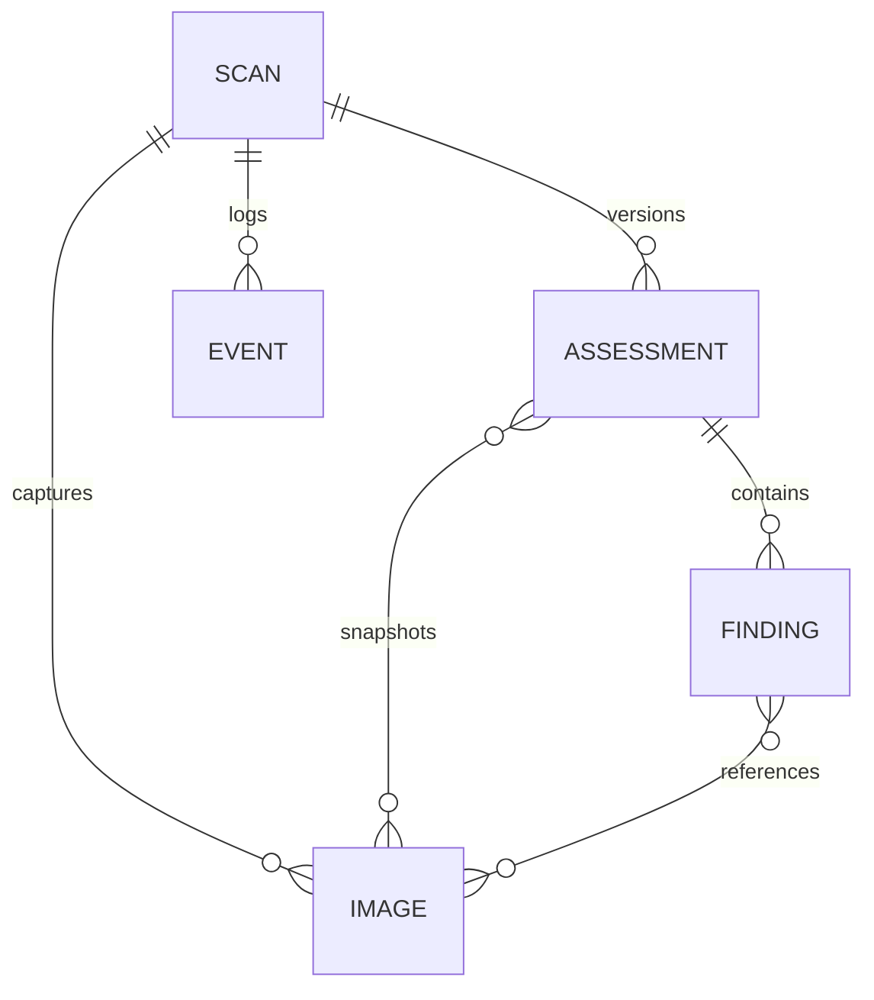
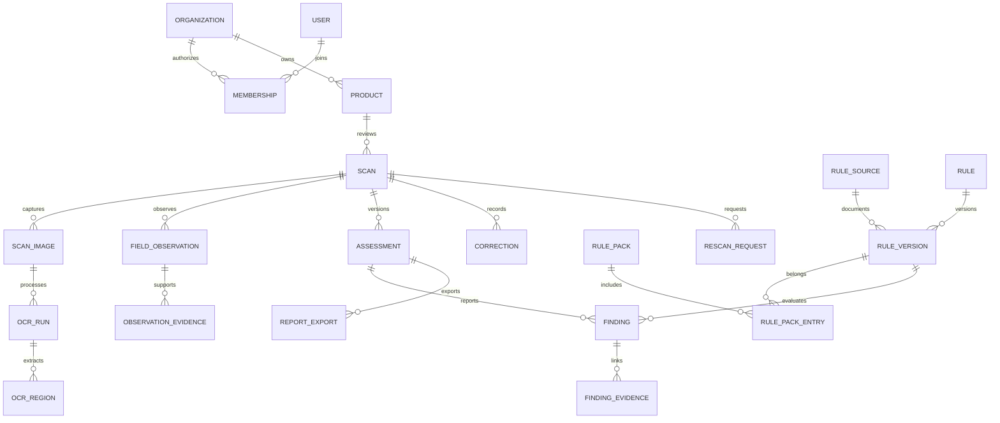

# Database models

Historical model notes. Use the current [architecture](specifications/03-Development-Architecture.md) for IndexedDB schema version 2 and the deployed Supabase tables. The older proposed production model below is not the deployed cloud schema.

## Deployed prototype: IndexedDB

Database name: `labelproof-workspace-v2`, schema version 1. Object stores use `id` as key. `scans`, `images`, `assessments` and `events` are committed together during assessment creation. `settings` holds preferences; `drafts` holds non-executable review notes.

`FINDING` is embedded in the current assessment object, not a separate IndexedDB store. Image references and region coordinates link it to original evidence. Original bytes are blobs. Assessment snapshots retain the product metadata and relevant image metadata used for that version.

Older report IDs cannot be overwritten through the application. Corrected findings are new assessment records. This is application-level versioning; browser data remains user-controlled.

## Proposed production model — not deployed

`database/production-schema.sql` describes PostgreSQL tables for organizations/users/memberships, products/scans/images, OCR runs/regions, observations/evidence, coverage, rule sources/versions/packs, assessments/findings, rescans/corrections, registry attempts, jobs/exports and audits.

The SQL is a reviewable design artifact and was not executed against a provisioned database. Authentication, tenant enforcement, authorized rule publication, object-store access, immutable-record guards, migrations and deletion/retention policies must be completed before production use. Do not connect this unreviewed schema directly to public requests.

## v3 local additions

IndexedDB version 2 adds operations (jobs, preliminary workflow events, error records and rule-review drafts) and captureDrafts (saved metadata and original image blobs). The SQL in supabase/schema.sql defines organization roles, private evidence access, version-checked snapshots and role-checked review events. It is deployed to the approved LabelProof Supabase project in Mumbai. Apply schema.sql followed by 002_review_bindings.sql to reproduce it. Review events contain the exact snapshot version and database-normalized SHA-256 of the reviewed assessment. Browser users have read grants only; writes run through server membership checks. The earlier normalized production-schema.sql is still a proposed expansion, not the deployed schema.
