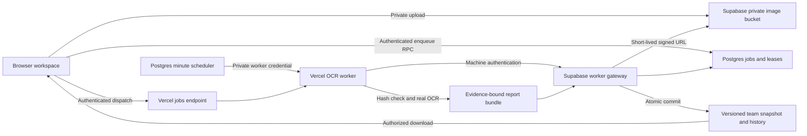
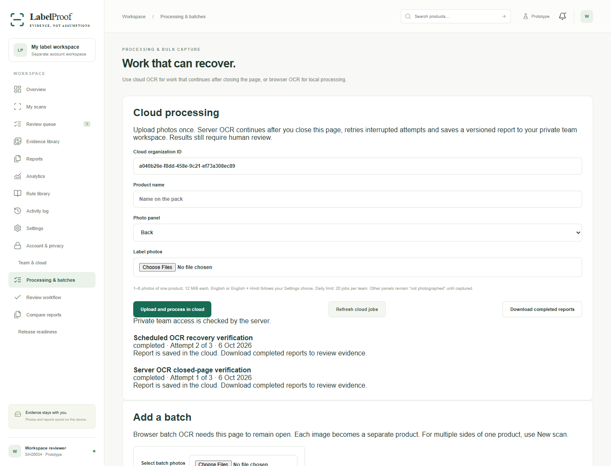
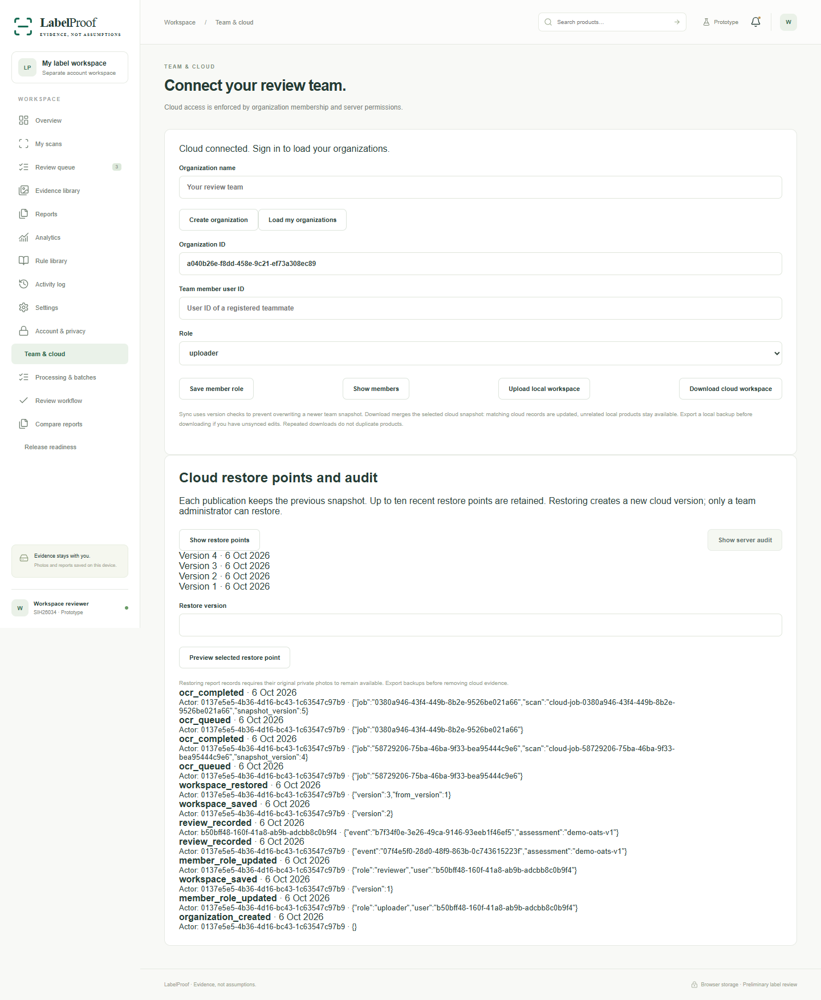

# LabelProof v3.4 — implemented application upgrade

Updated 6 October 2026. The PRD/SRS/architecture/UX/testing specifications are now being implemented as app behavior. The document-download screen and its navigation item were removed. `/dashboard/documents` redirects to working Processing & batches. Reference files remain available separately.

## Working features

| Requirement | Implementation | Practical boundary |
| --- | --- | --- |
| Account separation | Per-account IndexedDB databases, session-aware reload, photo/draft/settings separation, account-change guards | Browser-profile access is not encrypted; downloaded files remain outside the app |
| Background processing | Database queue, server Tesseract OCR, private signed downloads, worker credential in Vault/Vercel, scheduled recovery | Six photos/job, 12 MiB/photo, 40 MP/image, one active worker, 20 jobs/team/day, 100 globally/day |
| Processing recovery | Five-minute claim leases, at most three attempts, claim-token checks, request idempotency | Exhausted jobs show their failure; upload a new request after fixing evidence |
| Evidence provenance | Worker verifies uploaded SHA-256, decodes permitted still image types, normalizes OCR input, preserves original private bytes and coordinates | OCR confidence is a heuristic; real-world accuracy is not yet established |
| Server report validation | Envelope/count/identifier checks, evidence graph, bounds, private object paths, absence coverage, immutable assessment IDs | Locally submitted extraction is preliminary; physical byte validation is performed by the cloud OCR worker |
| Reviewer controls | Server membership roles, expected snapshot version, valid team assignments, immutable audit events and assessment hashes | Reviewer approval is not legal certification |
| Cloud recovery | Previous snapshot captured on publication; ten recent points; admin preview/restore; new version and audit on restore | Restore points depend on the original private photos remaining available; not an independent disaster backup |
| Local retention | Explicit opt-in and period, expiration on workspace opening, deletion of product/images/reports/events, retained deletion event | Cloud retention and account deletion remain separate work |
| Operational visibility | Cloud job status/attempts/errors, server audit viewer, structured worker logs, health flags | External alerts and incident response are not yet configured |

The central uncertainty model remains: **not photographed**, **unreadable**, **needs review**, and **potentially missing**. OCR non-detection never automatically becomes missing information. An absence finding needs explicit applicability, readable captured coverage and a review rationale.

## Architecture

New implementation files: `server/processor.js`, `api/jobs.js`, `api/worker.js`, `src/views/cloud-controls.js`, and `supabase/functions/labelproof-worker/index.ts`. Account isolation is implemented in `src/storage.js` and coordinated from `src/main.js`.

Apply the existing `supabase/schema.sql` and `supabase/002_review_bindings.sql`, then timestamped migrations in order. The worker merge correction is intentionally a separate migration so deployment history remains reproducible. The production project already has these migrations applied.

Configure the same private 64-character worker credential as `LABELPROOF_WORKER_SECRET` in Vercel production and the Vault secret named `labelproof_worker`. Never place it in frontend configuration, Git, screenshots, exports or a public API response. The gateway uses its built-in Supabase server credential and does not expose it to the browser. Its JWT check is replaced by explicit machine authentication in private database functions; ordinary authenticated clients cannot execute worker RPCs.

The scheduler calls the established production hostname only when work is pending and no valid lease is active. No new paid OCR provider or plan upgrade was created. Usage remains subject to the existing hosting/database quotas.

## Verification

- 25 unit/API/processor checks: passed. Includes evidence-source restrictions, hash mismatches, disguised uploads and EXIF coordinate handling.
- Full local browser suite: passed. Fast startup while cloud configuration is delayed; entered credentials are preserved when controls activate; dashboard buttons, capture/batches, reports/exports, storage upgrade, OCR errors, real browser OCR, retention and legacy document-route redirection.
- 12 normal-account cloud verification groups: passed against the real cloud project. Includes roles, forged metadata, organization isolation, private photo byte restoration, optimistic sync and repeat downloads without duplicates.
- Account isolation: passed using actual demo login/logout, separate preferences and photo drafts, and full page reloads.
- Server validation, version-bound reviews and admin restoration: passed using disposable accounts and synthetic evidence.
- Live cloud OCR: passed on the deployed Vercel/Supabase service with the browser closed: twelve synthetic English declarations, one report per request, SHA-linked original private image and a working evidence viewer. The initial result-merge defect was repaired in a separate migration before verification.

- Scheduler crash recovery: passed. A disposable worker claim was deliberately expired; the minute scheduler completed the job on attempt two, saved exactly one report and rejected the stale worker token.
- Hosted route/API checks: all nineteen routes and metadata endpoints passed; demo login/mobile and real account-cache isolation passed on the deployed release.
- Dependency audit: zero reported vulnerabilities. Supabase reports only the existing leaked-password warning, deliberate deny-all demo registry notice and an informational newly unused assignment index.

All accuracy checks here use clean synthetic English fixtures. They are functional checks, not a benchmark for Indian packaging, languages, lighting or curved containers.

## Remaining release requirements

Public signup and recovery need a verified sender domain, provider credentials and configured Supabase email/redirect settings. The owner has stated they have no sender domain; email confirmation remains enabled.

Operative legal rule packs need expert-reviewed category applicability, exceptions, precise clauses, effective dates and publication approval. Existing rule references and format checks remain preliminary. Registry verification is not connected.

Before a production compliance service launch: complete independent backup/restore drills, cloud retention and account/data deletion, external failure alerts, a held-out real packaging evaluation, privacy/incident procedures and deployment/rollback automation. The existing free Auth plan also reports [leaked-password protection](https://supabase.com/docs/guides/auth/password-security#password-strength-and-leaked-password-protection) as disabled; no paid upgrade was authorized or performed.

Do not present this release as government certification or a fully validated production compliance engine.

## Verified application screens

